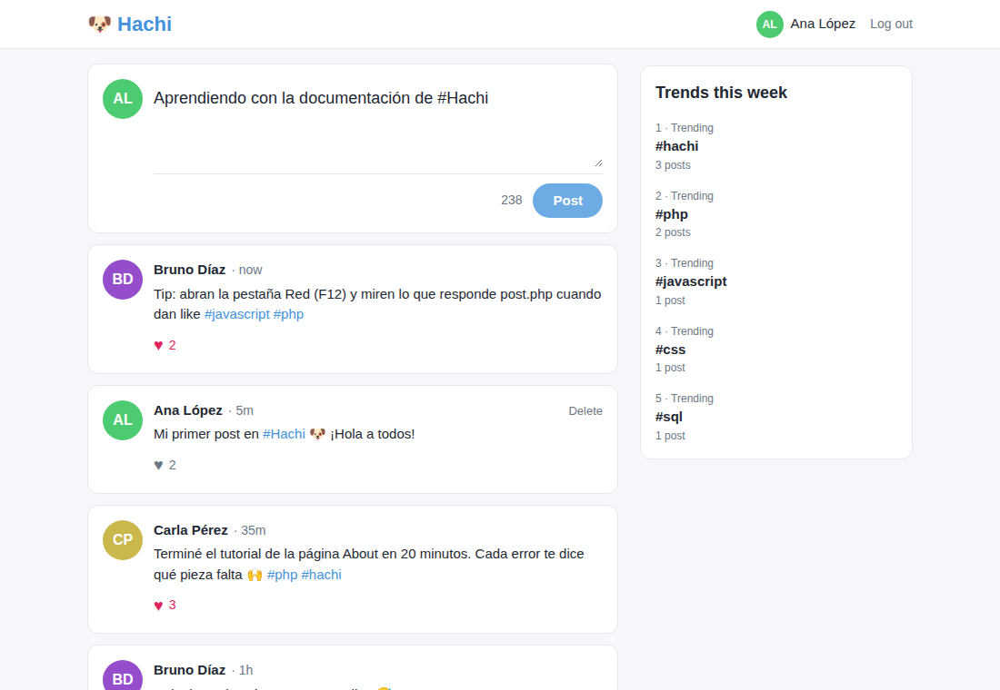

# 🐶 Hachi: una red social sencilla estilo Twitter

Hachi es una red social pequeña hecha con **PHP, HTML, CSS, JavaScript y SQL**, sin frameworks.
Está pensada para **aprender y practicar**: el código es corto, está comentado en español
y la carpeta [`docs/`](docs/) explica paso a paso cómo funciona cada parte.



## Qué se puede hacer

- Crear una cuenta, iniciar y cerrar sesión ("Remember me" mantiene la sesión 30 días).
- Publicar posts de hasta 280 caracteres, con un contador que se actualiza mientras escribes (`Ctrl + Enter` publica).
- Dar y quitar likes.
- Borrar tus propios posts.
- Ver los posts de una persona haciendo clic en su nombre.
- Usar **#hashtags**: cada uno es un enlace a todos los posts que lo usan.
- Ver las **tendencias de la semana**: los 5 hashtags más usados en los últimos 7 días.

## Pruébalo en 3 minutos

Solo necesitas PHP 7.4 o más nuevo. No hace falta instalar MySQL.

```bash
git clone https://github.com/bgabrielescobar/hachi-social-network.git
cd hachi-social-network
cp .env.example .env        # en Windows: copy .env.example .env
```

Abre `.env` con tu editor y cambia `DB_DRIVER=mysql` por `DB_DRIVER=sqlite`. Después:

```bash
php -S localhost:8000
```

Abre http://localhost:8000 y crea una cuenta. ¿Algo no funciona? Mira [1. Instalación](docs/1-instalacion.md).

## Guías para aprender

Están pensadas para leerse en orden:

| # | Guía | Qué vas a aprender |
|---|------|--------------------|
| 1 | [Instalación](docs/1-instalacion.md) | Instalar PHP, arrancar el proyecto y resolver los errores más comunes |
| 2 | [Arquitectura](docs/2-arquitectura.md) | Cómo está organizado el código: Bootstrap, controladores, módulos y vistas |
| 3 | [Recorrido de una petición](docs/3-recorrido-de-una-peticion.md) | Qué pasa, archivo por archivo, al abrir el timeline, publicar o dar like |
| 4 | [Base de datos](docs/4-base-de-datos.md) | Las tablas, cómo se relacionan y las consultas SQL explicadas |
| 5 | [Seguridad](docs/5-seguridad.md) | Contraseñas, sesiones, inyección SQL, XSS y CSRF, con los errores que tenía este proyecto |
| 6 | [Frontend](docs/6-frontend.md) | El CSS y el JavaScript: `fetch`, eventos y diseño para celulares |
| 7 | [Tutorial: agregar una página](docs/7-tutorial-nueva-pagina.md) | Crear tu primera página, paso a paso |
| 8 | [Ejercicios](docs/8-ejercicios.md) | 17 ideas para practicar, de fáciles a difíciles, con pistas |
| | [Glosario](docs/glosario.md) | Las palabras técnicas, explicadas |

## Mapa del proyecto

```
hachi-social-network/
├── index.php ... logout.php   Puntos de entrada: uno por página o acción (tabla de abajo)
├── App/
│   ├── Bootstrap/             Arranca la aplicación en cada petición
│   ├── Config/                Settings: la configuración
│   ├── Controller/            Reciben la petición y deciden la respuesta
│   ├── Module/                Preparan los datos y arman la página
│   ├── View/                  El HTML de cada página
│   └── Helpers/               Herramientas: base de datos, sesión, hashtags
├── public/
│   ├── css-min/               Estilos: master (todas las páginas), Index y Home (cada página)
│   ├── js-min/                JavaScript, organizado igual que el CSS
│   └── img/                   Imágenes
├── database/                  Las tablas: schema.sql (MySQL) y schema.sqlite.sql (SQLite)
├── docs/                      Esta documentación
├── .env.example               Plantilla de la configuración
└── .htaccess                  Reglas de seguridad para servidores Apache
```

| Archivo | Tipo | Qué hace |
|---|---|---|
| `index.php` | Página | Login y registro |
| `home.php` | Página | Timeline, perfil (`home.php?user=ID`) y hashtag (`home.php?tag=nombre`) |
| `login.php` | JSON | Inicia sesión |
| `register.php` | JSON | Crea una cuenta |
| `post.php` | JSON | Publica, borra y da like |
| `logout.php` | Redirección | Cierra la sesión y vuelve al login |

## Publicarlo en un hosting con MySQL

1. Crea una base de datos y ejecuta [`database/schema.sql`](database/schema.sql)
   (por ejemplo, desde phpMyAdmin → **Importar**). Se puede volver a ejecutar sin perder datos: solo crea las tablas que faltan.
2. Sube los archivos y crea el `.env` a partir de `.env.example`, con `DB_DRIVER=mysql` y los datos de tu base
   (`HOST`, `DB_NAME`, `USER_NAME`, `PASSWORD`).
3. Deja `APP_DEBUG=0`.

El `.env` no se guarda en Git para que las contraseñas no terminen en el repositorio.
En servidores Apache, el `.htaccess` impide descargarlo y ver el código.

## Tecnologías

- **PHP 7.4+** con PDO (MySQL o SQLite) y la extensión mbstring.
- **HTML y CSS** sin librerías: flexbox, variables CSS y media queries.
- **JavaScript** sin librerías: `fetch`, `async`/`await` y eventos.
- La fuente [Poppins](https://fonts.google.com/specimen/Poppins) y los iconos
  [Material Design Iconic Font](https://zavoloklom.github.io/material-design-iconic-font/), cargados desde internet.

Host original: https://hachi-sn.000webhostapp.com/index.php
