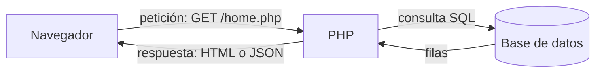
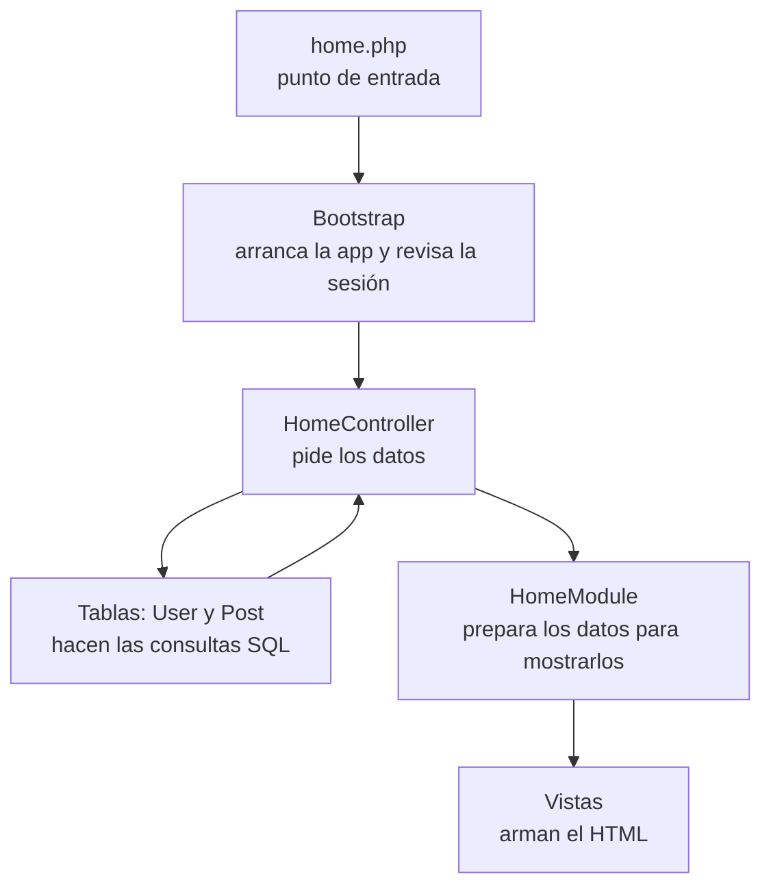
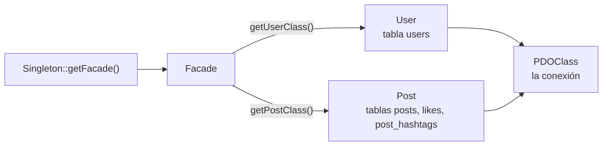
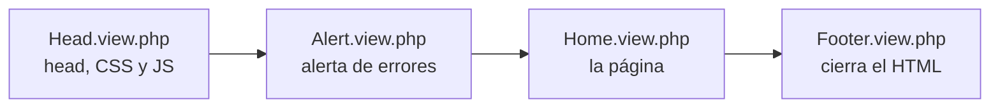

# 2. Arquitectura: cómo está organizado el código

Esta guía explica qué hace cada carpeta y cómo se conectan las piezas.
Si todavía no tienes el proyecto funcionando, empieza por [1. Instalación](1-instalacion.md).

## La idea general

Cada vez que haces algo en Hachi, el navegador le envía una **petición** al servidor.
PHP la recibe, consulta la base de datos si hace falta y devuelve una **respuesta**.



Hay dos tipos de respuesta:

| Tipo | Archivos | Qué devuelve | Quién la pide |
|---|---|---|---|
| **Página** | `index.php`, `home.php` | Una página HTML completa | El navegador, al entrar a la dirección o hacer clic en un enlace |
| **Endpoint JSON** | `login.php`, `register.php`, `post.php` | Un dato pequeño, por ejemplo `{"code":0}` | El JavaScript de la página, con `fetch`, sin recargar la página |

`logout.php` no devuelve nada: cierra la sesión y redirige a `index.php`.

## Las capas

Todas las peticiones pasan por las mismas capas, como en una cadena de montaje.
Así se ve la petición de `home.php`:



| Capa | Carpeta | Qué hace | Ejemplo |
|---|---|---|---|
| Punto de entrada | raíz del proyecto | Arranca el Bootstrap | `home.php` |
| Bootstrap | `App/Bootstrap` | Carga la configuración, revisa la sesión y elige el controlador | `Bootstrap.php` |
| Controlador | `App/Controller` | Recibe la petición, pide los datos y decide la respuesta | `HomeController.php` |
| Tablas | `App/Helpers/Database/Tables` | Hablan con la base de datos (SQL) | `Post.php` |
| Módulo | `App/Module` | Prepara los datos para mostrarlos y arma la página | `HomeModule.php` |
| Vista | `App/View` | El HTML, con huecos para los datos | `Home.view.php` |

> Si conoces el patrón **MVC** (Modelo-Vista-Controlador): las tablas son el **modelo**, las vistas son la **vista**
> y los controladores son el **controlador**. El módulo es una capa extra entre el controlador y la vista.

## La convención de nombres (lo más importante)

En ningún lugar hay una lista de páginas. **Todo se conecta por el nombre del archivo.**
El Bootstrap toma `home.php`, lo convierte en `Home` y cada capa arma su nombre de archivo a partir de `Home`:

| Pieza | Archivo para la página "Home" |
|---|---|
| Punto de entrada | `home.php` |
| Controlador | `App/Controller/HomeController.php` |
| Módulo | `App/Module/HomeModule.php` |
| Vista | `App/View/Home.view.php` |
| CSS de la página (opcional) | `public/css-min/Home.min.css` |
| JavaScript de la página (opcional) | `public/js-min/Home.min.js` |

Para crear una página nueva, basta con crear estos archivos con el mismo nombre.
Lo haces paso a paso en el [tutorial](7-tutorial-nueva-pagina.md).

Los endpoints JSON (`login.php`, `register.php`, `post.php`) solo tienen punto de entrada y controlador,
porque no muestran HTML.

---

## 1. Los puntos de entrada

Los archivos `.php` de la raíz son todos iguales:

```php
include 'App/Bootstrap/Bootstrap.php';

\App\Bootstrap\Bootstrap::start();
```

Lo único que cambia es **el nombre del archivo**, y eso es lo que usa el Bootstrap para decidir qué hacer.

## 2. El Bootstrap (`App/Bootstrap/Bootstrap.php`)

Es lo primero que se ejecuta en cada petición. `Bootstrap::start()` hace cuatro pasos:

```php
public static function start(): void
{
    self::classLoader();     // 1. autoloader
    self::initEnv();         // 2. lee el .env
    self::initSet();         // 3. mostrar u ocultar errores
    self::initController();  // 4. revisa la sesión y ejecuta el controlador
}
```

### Paso 1: el autoloader

En PHP, para usar una clase que está en otro archivo hay que cargar ese archivo con `require`.
El **autoloader** lo hace solo: cuando el código usa una clase que todavía no se cargó,
PHP llama a la función registrada con `spl_autoload_register` y esta hace el `require`.

Funciona porque el **namespace** de cada clase coincide con sus carpetas:

```
App\Helpers\Session\SessionManager   →   App/Helpers/Session/SessionManager.php
App\Controller\HomeController        →   App/Controller/HomeController.php
```

Por eso, si creas una clase nueva, su `namespace` tiene que coincidir con la carpeta donde la guardas.

### Paso 2: la configuración (`.env` → `Settings`)

`initEnv()` lee el archivo `.env` (líneas `CLAVE=valor`) y guarda cada valor en la clase
`App/Config/Settings.php`. Desde cualquier parte del código se leen así:

```php
Settings::get('DB_DRIVER');   // "sqlite"
```

`Settings` también tiene valores fijos (las rutas del CSS y el JS) y guarda `'controller'`,
el nombre de la página actual (`"Home"`).

### Paso 3: mostrar u ocultar errores

Con `APP_DEBUG=1` los errores de PHP se ven en la página. En un sitio publicado se deja en `0`,
porque los mensajes de error pueden mostrar información interna.

### Paso 4: revisar la sesión y ejecutar el controlador

`initController()` convierte el nombre del archivo en el nombre del controlador:

```
"/home.php"  →  "Home"  →  new \App\Controller\HomeController()  →  indexAction()
```

Antes de ejecutarlo, `checkAccess()` revisa si la persona puede ver esa página:

| Página | Sin sesión iniciada | Con sesión iniciada |
|---|---|---|
| `index.php` (login) | Se muestra | Redirige a `home.php` |
| `login.php`, `register.php` | Funcionan | Funcionan |
| `home.php`, `logout.php` | Redirigen a `index.php` | Funcionan |
| `post.php` | Responde error 401 en JSON | Funciona |

Las páginas que se pueden ver sin sesión están en la constante `PUBLIC_CONTROLLERS`:

```php
const PUBLIC_CONTROLLERS = ['Index', 'Login', 'Register'];
```

## 3. Los controladores (`App/Controller`)

Todos heredan de `App/Controller/Base/Controller.php` y tienen el método `indexAction()`,
que es el que llama el Bootstrap.

**Un controlador de página** pide los datos, los guarda en `$this->data` y llama a `postController()`,
que se los pasa al módulo. Versión resumida de `HomeController`:

```php
public function indexAction()
{
    $userId = SessionManager::getInstance()->getUserId();

    $this->data = [
        'user' => $userTable->selectUserById($userId),
        'posts' => $postTable->selectTimeline($userId, $authorId, $tag),
        'trends' => $postTable->selectWeeklyTrends(),
        // ...
    ];

    $this->postController();   // HomeController -> HomeModule
}
```

**Un controlador JSON** lee lo que envió el JavaScript con `readJson()` y contesta con `jsonResponse()`
o `jsonError()`. `PostController` usa el campo `action` para saber qué hacer:

```php
switch ($data['action'] ?? '') {
    case 'create': $this->create(...); break;
    case 'delete': $this->delete(...); break;
    case 'like':   $this->like(...);   break;
    default:       $this->jsonError('Unknown action', 400);
}
```

Las respuestas JSON siempre llevan `code`: **0 si salió bien, 1 si hubo un error**.
Los errores traen además `title` y `message`, que el JavaScript muestra en la alerta roja:

```json
{"code": 1, "title": "FAILED!", "message": "Wrong email or password"}
```

> `jsonResponse()` y `jsonError()` terminan la petición con `exit`: el código que viene después ya no se ejecuta.
> Por eso en los controladores no hace falta un `else` después de un error.

## 4. La base de datos (`App/Helpers/Database`)

Para hablar con la base de datos se usa siempre el mismo camino:

```php
Singleton::getFacade()->getPostClass()->selectTimeline($userId);
```



| Clase | Qué hace |
|---|---|
| `Singleton` | Da siempre el mismo objeto `Facade` (patrón **Singleton**) |
| `Facade` | Un solo lugar para pedir cualquier tabla (patrón **Facade**) |
| `Tables/User.php` | Consultas de usuarios: crear cuenta, login, buscar por id |
| `Tables/Post.php` | Consultas de posts, likes, hashtags y tendencias |
| `Tables/Base/PDOClass.php` | Abre la conexión con PDO (MySQL o SQLite) y la comparte |

Todo el detalle de las tablas y las consultas está en [4. Base de datos](4-base-de-datos.md).

## 5. Los módulos (`App/Module`)

El módulo recibe los datos del controlador y los deja listos para mostrar.
Por ejemplo, la base de datos devuelve `first_name`, `last_name` y `created_at`,
y `HomeModule` calcula lo que ve el usuario:

| Dato de la base de datos | Lo que calcula `HomeModule` | Ejemplo |
|---|---|---|
| `first_name`, `last_name` | `name`, `initials` | `Ana López`, `AL` |
| `user_id` | `color` del avatar | `hsl(137, 55%, 55%)` |
| `created_at` | `date` | `5m`, `3h`, `Sep 27` |
| `content` | `content_html` (hashtags como enlaces) | `Hola <a href="home.php?tag=php">#php</a>` |
| `user_id` del post | `is_mine` (¿mostrar "Delete"?) | `true` |

Después elige las vistas y llama a `render()`, que arma la página en este orden:



`render()` también agrega el CSS y el JavaScript: primero los de todas las páginas (`master`)
y después los de la página actual, si existen (`Home.min.css`, `Home.min.js`).

> ¿Por qué separar controlador y módulo? El controlador se ocupa de **qué datos** hacen falta;
> el módulo, de **cómo se muestran**. Si mañana cambias el formato de la fecha, solo tocas el módulo.

## 6. Las vistas (`App/View`)

Son archivos HTML con partes de PHP para poner los datos. Reciben todo en la variable `$data`:

```php
<?php foreach ($data['posts'] as $post): ?>
    <article class="card post">
        <a href="home.php?user=<?php echo $post['user_id'] ?>"><?php echo htmlspecialchars($post['name']) ?></a>
        <p class="post-content"><?php echo $post['content_html'] ?></p>
    </article>
<?php endforeach ?>
```

- `foreach (...):` y `endforeach` (o `if (...):` y `endif`) son la **sintaxis alternativa** de PHP,
  más fácil de leer entre HTML que las llaves `{ }`.
- **Todo texto escrito por usuarios pasa por `htmlspecialchars()`** antes de mostrarse.
  Así nadie puede meter HTML o JavaScript en la página. Lo explica [5. Seguridad](5-seguridad.md).

## 7. Otros helpers (`App/Helpers`)

| Clase | Qué hace |
|---|---|
| `Session/SessionManager.php` | Inicia y cierra la sesión y dice qué usuario está conectado |
| `Hashtag/Hashtag.php` | Encuentra los `#hashtags` de un texto y los convierte en enlaces |
| `Logger/Logger.php` | Guarda mensajes en memoria. **Todavía no se usa** |

## 8. Los archivos públicos (`public/`)

CSS, JavaScript e imágenes. El navegador los descarga directamente, sin pasar por PHP.
Los explica [6. Frontend](6-frontend.md).

## 9. Configuración y base de datos

| Archivo | Para qué |
|---|---|
| `.env.example` | Plantilla de la configuración. Se copia como `.env` |
| `database/schema.sql` | Las tablas para MySQL |
| `database/schema.sqlite.sql` | Las mismas tablas para SQLite (se ejecuta solo) |
| `.htaccess` | Reglas de seguridad para servidores Apache |
| `.gitignore` | Archivos que Git no guarda (`.env`, la base de datos SQLite) |

---

[← 1. Instalación](1-instalacion.md) · Siguiente: [3. Recorrido de una petición →](3-recorrido-de-una-peticion.md)
