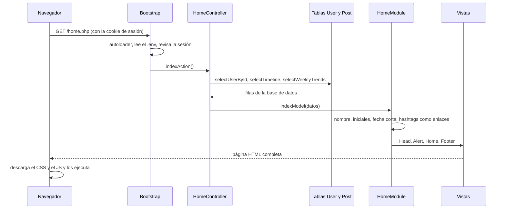
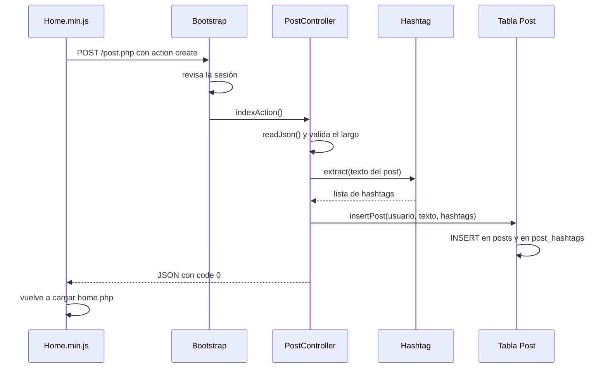

# 3. Recorrido de una petición

En [2. Arquitectura](2-arquitectura.md) viste las piezas por separado. Aquí las vas a ver trabajando juntas:
seguimos cuatro acciones reales, archivo por archivo, desde el clic hasta lo que aparece en pantalla.

Abre los archivos en tu editor mientras lees: vas a entender mucho más rápido.

---

## Recorrido 1: abrir el timeline (`home.php`)



Paso a paso:

1. **El navegador pide la página.** Escribes `localhost:8000/home.php` (o haces clic en un enlace).
   El navegador envía la petición junto con la cookie de sesión `PHPSESSID`, si la tiene.

2. **`home.php` arranca el Bootstrap.** Es lo único que hace este archivo.

3. **`Bootstrap::start()` prepara todo** (`App/Bootstrap/Bootstrap.php`):
   - registra el autoloader;
   - lee el `.env` y lo guarda en `Settings`;
   - convierte `home.php` en `Home` y lo guarda como `Settings::get('controller')`.

4. **`checkAccess()` revisa la sesión.** `SessionManager` lee el id del usuario de la sesión.
   Si no hay sesión, redirige a `index.php` y todo termina aquí. Si hay, sigue.

5. **Se ejecuta `HomeController::indexAction()`** (`App/Controller/HomeController.php`), que pide a la base de datos:
   - el usuario conectado → `User::selectUserById()`
   - los últimos 50 posts → `Post::selectTimeline()`
   - las tendencias de la semana → `Post::selectWeeklyTrends()`

   Si la dirección era `home.php?user=3` o `home.php?tag=php`, `selectTimeline()` recibe también ese filtro.

6. **`postController()` le pasa los datos a `HomeModule`** (`App/Module/HomeModule.php`), que calcula
   el nombre completo, las iniciales y el color del avatar, la fecha corta (`5m`), los hashtags como enlaces
   y si cada post es tuyo (para mostrar "Delete").

7. **`render()` arma la página** con las vistas en orden: `Head.view.php` → `Alert.view.php` →
   `Home.view.php` → `Footer.view.php`. Cada vista escribe su parte del HTML usando `$data`.

8. **El navegador recibe el HTML**, descarga los archivos CSS y JS que aparecen en el `<head>` y los ejecuta.
   `Home.min.js` prepara la caja para escribir y los botones de like.

---

## Recorrido 2: publicar un post

Escribes `Hola #mundo` y pulsas **Post**. La página no se envía como un formulario normal:
lo hace JavaScript con `fetch`.



1. **JavaScript intercepta el envío** (`public/js-min/Home.min.js`). `event.preventDefault()` evita que
   el navegador recargue la página, y `postJson()` (de `master.min.js`) envía los datos.
   Esta es la petición que viaja por la red:

   ```http
   POST /post.php HTTP/1.1
   Content-Type: application/json
   Cookie: PHPSESSID=8f3a...

   {"action":"create","content":"Hola #mundo"}
   ```

2. **El Bootstrap revisa la sesión.** `post.php` no es pública: sin sesión respondería un error 401
   y `postJson()` mandaría al usuario al login.

3. **`PostController::indexAction()`** (`App/Controller/PostController.php`) lee el JSON con `readJson()`.
   Como `action` es `create`, llama a `create()`.

4. **`create()` valida el texto.** `mb_strlen()` cuenta los caracteres: tiene que haber entre 1 y 280.
   El JavaScript ya lo revisó, pero **el servidor nunca confía en el navegador** y lo vuelve a revisar.

5. **`Hashtag::extract()` busca los hashtags** (`App/Helpers/Hashtag/Hashtag.php`): devuelve `['mundo']`.

6. **`Post::insertPost()` guarda todo** (`App/Helpers/Database/Tables/Post.php`) dentro de una transacción:

   ```sql
   INSERT INTO posts (user_id, content, created_at) VALUES (1, 'Hola #mundo', '2026-09-27 18:00:00');
   INSERT INTO post_hashtags (post_id, tag) VALUES (7, 'mundo');
   ```

7. **El controlador responde** con `jsonResponse(['code' => 0])`:

   ```http
   HTTP/1.1 200 OK
   Content-Type: application/json

   {"code":0}
   ```

8. **JavaScript recibe la respuesta.** Como `code` es 0, carga `home.php` otra vez (el recorrido 1)
   y el post nuevo aparece arriba, con `#mundo` como enlace y contando en las tendencias.
   Si `code` fuera 1, mostraría `title` y `message` en la alerta roja.

---

## Recorrido 3: dar like (sin recargar la página)

1. **Haces clic en el corazón.** `Home.min.js` tiene un solo "escuchador" de clics para todo el timeline
   (se llama **delegación de eventos**). Con `event.target.closest('.post')` averigua en qué post fue el clic
   y lee su id del atributo `data-post-id`.

2. **Envía** `{"action": "like", "post_id": "5"}` a `post.php`.

3. **`PostController::like()`** llama a `Post::toggleLike()`, que primero intenta **borrar** tu like.
   Si borró una fila es que ya lo tenías: ahora ya no está. Si no borró nada, lo **agrega**.

4. **Responde cómo quedó:** `{"code":0,"liked":true,"likes":3}`.

5. **JavaScript actualiza solo ese botón:** le pone la clase `liked` (el corazón rojo) y cambia el número.
   El resto de la página no se toca.

---

## Recorrido 4: iniciar sesión

1. En `index.php` completas el formulario y pulsas **Log in**. `Index.min.js` envía
   `{"email": "...", "pass": "...", "remember-me": "on"}` a `login.php`.
   (`remember-me` solo se envía si marcaste la casilla).

2. **`LoginController`** busca al usuario por email con `User::selectLoginUser()`, que compara la contraseña
   con `password_verify()`.

3. Si es correcta, **`SessionManager::login()`** guarda el id del usuario en la sesión (`$_SESSION['user_id']`)
   y el servidor le envía al navegador la cookie `PHPSESSID`. Desde ahora el navegador la envía en cada petición.

4. Responde `{"code":0}` y el JavaScript va a `home.php`. En el recorrido 1, `checkAccess()` encuentra la sesión y deja pasar.

---

## Míralo tú mismo

### Las herramientas del navegador

1. Abre el timeline y pulsa `F12` (o clic derecho → **Inspeccionar**).
2. Ve a la pestaña **Red** (Network).
3. Dale like a un post: aparece una petición a `post.php`.
4. Haz clic en ella: en **Carga útil** (Payload) ves lo que envió el JavaScript y en **Respuesta** (Response) lo que contestó PHP.

### La terminal del servidor

Mientras usas la app, la terminal donde corre `php -S` muestra cada petición:

```
[Sun Sep 27 18:00:13 2026] 127.0.0.1:54321 [200]: POST /post.php
```

El número entre corchetes es el **código de estado HTTP**: 200 salió bien, 302 es una redirección,
400 petición inválida, 401 falta la sesión, 500 error del servidor.

### Mirar los datos desde PHP

Un truco para ver qué datos hay en un punto del código. Por ejemplo, en `HomeController`, antes de `$this->postController();`:

```php
error_log(print_r($this->data, true));
```

`print_r` convierte el array en texto y `error_log` lo escribe en la terminal del servidor sin romper la página.
Recarga el timeline, mira la terminal y **no olvides borrar la línea** cuando termines.

---

[← 2. Arquitectura](2-arquitectura.md) · Siguiente: [4. Base de datos →](4-base-de-datos.md)
