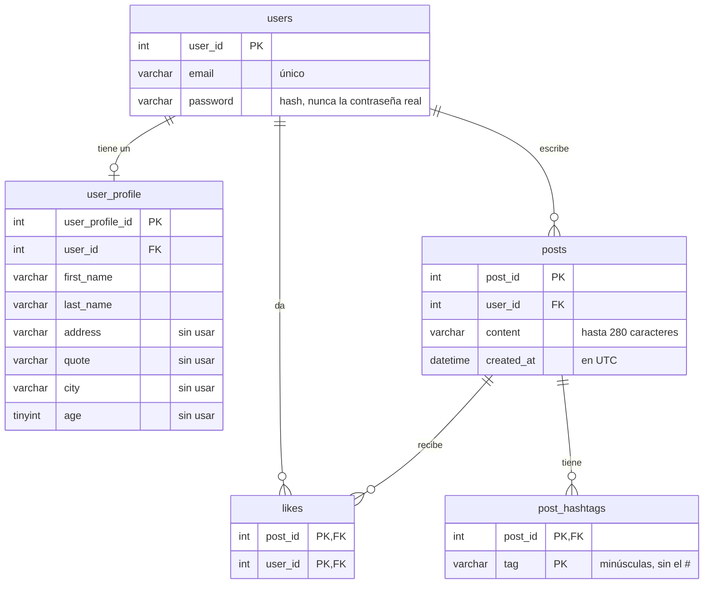

# 4. Base de datos

Aquí vas a conocer las tablas de Hachi, cómo se relacionan y cómo el código PHP les hace preguntas con SQL.

## Lo básico en 1 minuto

- Una **base de datos** guarda la información en **tablas**, parecidas a hojas de cálculo.
- Cada **fila** es un registro (un usuario, un post) y cada **columna** es un dato (email, fecha...).
- La **clave primaria** (*primary key*, PK) identifica cada fila sin repetirse, por ejemplo `user_id`.
- Una **clave foránea** (*foreign key*, FK) es una columna que apunta a la fila de otra tabla.
  Por ejemplo, `posts.user_id` dice quién escribió el post.
- **SQL** es el lenguaje para leer y cambiar los datos: `SELECT`, `INSERT`, `UPDATE`, `DELETE`.

## Las tablas



Cómo leer las líneas: `||--o{` significa "uno a muchos" (un usuario escribe muchos posts)
y `||--o|` "uno a uno" (un usuario tiene un perfil).

### `users`: las cuentas

| user_id | email | password |
|---|---|---|
| 1 | ana@example.com | `$2y$10$Jp3...` (hash) |
| 2 | bob@example.com | `$2y$10$Qx9...` (hash) |

El email es `UNIQUE`: la base de datos no deja crear dos cuentas con el mismo.
La contraseña se guarda como **hash** (ver [5. Seguridad](5-seguridad.md)).

### `user_profile`: los datos personales

| user_profile_id | user_id | first_name | last_name | address | quote | city | age |
|---|---|---|---|---|---|---|---|
| 1 | 1 | Ana | López | | | | |

Está separada de `users` para no mezclar los datos de acceso con los personales.
Las columnas `address`, `quote`, `city` y `age` existen pero **todavía no se usan**
(hay un ejercicio para eso en [8. Ejercicios](8-ejercicios.md)).

### `posts`: las publicaciones

| post_id | user_id | content | created_at |
|---|---|---|---|
| 7 | 1 | Hola #mundo | 2026-09-27 18:00:00 |

`created_at` se guarda en **UTC** (la hora universal), no en la hora local del servidor.
Así la fecha no cambia si el servidor está en otro país. `HomeModule` la convierte en `5m`, `3h`, etc.

### `likes`: quién le dio like a qué

| post_id | user_id |
|---|---|
| 7 | 2 |

Cada fila es un like. La clave primaria es la **pareja** `(post_id, user_id)`: como no se puede repetir,
**es imposible dar dos likes al mismo post**. El total de likes se calcula contando filas con `COUNT(*)`.

> ¿Por qué no una columna `likes` con un número en la tabla `posts`? Porque con solo un número
> no sabríamos **quién** dio like, y no podríamos pintar tu corazón de rojo ni impedir likes repetidos.

### `post_hashtags`: los hashtags de cada post

| post_id | tag |
|---|---|
| 7 | mundo |
| 8 | php |
| 8 | mysql |

Cuando se publica un post, `Hashtag::extract()` saca sus hashtags y se guarda una fila por cada uno.

> ¿Por qué no buscar los hashtags directamente en el texto con `LIKE '%#php%'`? Porque eso también
> encontraría `#phpmyadmin`, sería lento con muchos posts y no permite contarlos fácilmente.
> Con una tabla aparte, contar y filtrar es muy sencillo.

### Borrar en cascada

Las claves foráneas tienen `ON DELETE CASCADE`: si se borra un post, la base de datos borra sola sus likes y hashtags;
si se borra un usuario, se borran su perfil, sus posts y sus likes. Así no quedan datos "huérfanos".

## Dos motores: MySQL y SQLite

El proyecto funciona con dos bases de datos distintas, según `DB_DRIVER` en el `.env`:

| | SQLite | MySQL / MariaDB |
|---|---|---|
| Para qué | Programar en tu computadora | El sitio publicado en un hosting |
| Dónde están los datos | Un archivo: `database/hachi.sqlite` | Un servidor de base de datos |
| Instalación | Ninguna (viene con PHP) | Hay que instalarlo o usar el del hosting |
| Tablas | Se crean solas al conectar | Se crean ejecutando `database/schema.sql` |
| Esquema | `database/schema.sqlite.sql` | `database/schema.sql` |

Los dos esquemas tienen **las mismas tablas**, escritas con los tipos de cada motor:

| MySQL | SQLite |
|---|---|
| `int NOT NULL AUTO_INCREMENT` | `INTEGER PRIMARY KEY AUTOINCREMENT` |
| `varchar(255)`, `datetime` | `TEXT` |
| `ENGINE=InnoDB DEFAULT CHARSET=utf8mb4` | (no hace falta) |

Las consultas del código son SQL estándar y funcionan igual en los dos.

> Si cambias una tabla, **cambia los dos archivos de esquema**.

## Cómo habla PHP con la base de datos: PDO

PHP usa **PDO**, una forma única de trabajar con MySQL, SQLite y otras bases de datos.
La conexión se abre en `App/Helpers/Database/Tables/Base/PDOClass.php` y las clases de las tablas la usan
con `$this->pdo`. Todas las consultas siguen los mismos tres pasos:

```php
// 1. Preparar el SQL con "huecos" (:email) en lugar de los datos
$stmt = $this->pdo->prepare("SELECT user_id, password FROM users WHERE email = :email");

// 2. Ejecutarlo pasando los datos por separado
$stmt->execute(['email' => $email]);

// 3. Leer el resultado
$user = $stmt->fetch();          // una fila: ['user_id' => 1, 'password' => '$2y$...'], o false
```

Separar el SQL de los datos es lo que protege contra la **inyección SQL** ([5. Seguridad](5-seguridad.md)).
**Nunca metas variables directamente dentro del texto del SQL.**

Los métodos de PDO que usa el proyecto:

| Método | Qué hace | Ejemplo en el código |
|---|---|---|
| `prepare($sql)` | Prepara la consulta | Todas |
| `execute($datos)` | La ejecuta con los datos | Todas |
| `fetch()` | Devuelve la siguiente fila, o `false` si no hay | `User::selectUserById()` |
| `fetchAll()` | Devuelve todas las filas en un array | `Post::selectTimeline()` |
| `fetchColumn()` | Devuelve solo la primera columna de la fila | `Post::countLikes()` |
| `lastInsertId()` | El id que se le asignó a la última fila insertada | `User::insertUser()` |
| `rowCount()` | Cuántas filas cambió un `INSERT`, `UPDATE` o `DELETE` | `Post::deletePost()` |
| `beginTransaction()` / `commit()` | Agrupa varias consultas en una transacción | `Post::insertPost()` |

### Transacciones

Crear una cuenta necesita dos `INSERT`: uno en `users` y otro en `user_profile`. ¿Y si el segundo falla?
Quedaría un usuario sin perfil. Una **transacción** agrupa las consultas: o se guardan todas o ninguna.

```php
$this->pdo->beginTransaction();
// INSERT INTO users ...
// INSERT INTO user_profile ...
$this->pdo->commit();   // recién aquí se guarda todo
```

Si algo falla antes del `commit()`, PDO lanza una excepción y los cambios no se guardan.

## Las consultas importantes, explicadas

### El timeline (`Post::selectTimeline()`)

```sql
SELECT p.post_id, p.user_id, p.content, p.created_at,
       up.first_name, up.last_name,
       (SELECT COUNT(*) FROM likes l WHERE l.post_id = p.post_id) AS likes,
       (SELECT COUNT(*) FROM likes l WHERE l.post_id = p.post_id AND l.user_id = :viewer_id) AS liked
FROM posts p
LEFT JOIN user_profile up ON up.user_id = p.user_id
ORDER BY p.post_id DESC
LIMIT 50
```

Por partes:

- `FROM posts p`: la tabla principal. La `p` es un **alias**, un nombre corto para escribir `p.content` en lugar de `posts.content`.
- `LEFT JOIN user_profile up ON ...`: pega a cada post el nombre de su autor. `LEFT` significa
  "trae el post aunque el autor no tenga perfil".
- Las dos líneas `(SELECT COUNT(*) ...)` son **subconsultas**: para cada post cuentan
  cuántos likes tiene en total (`likes`) y si **tú** le diste like (`liked`: 1 o 0).
- `ORDER BY p.post_id DESC`: los ids crecen con cada post nuevo, así que ordenar por id de mayor a menor
  es ordenar del más nuevo al más viejo.
- `LIMIT 50`: solo los primeros 50.

Para `home.php?user=3` o `home.php?tag=php`, el código agrega un `WHERE` antes del `ORDER BY`:

```sql
WHERE p.user_id = :author_id
WHERE p.post_id IN (SELECT post_id FROM post_hashtags WHERE tag = :tag)
```

### Dar o quitar like (`Post::toggleLike()`)

```sql
-- 1. Intentar quitar el like
DELETE FROM likes WHERE post_id = :post_id AND user_id = :user_id;

-- 2. Si no se borró nada (rowCount() == 0), no lo tenía: agregarlo
INSERT INTO likes (post_id, user_id) SELECT post_id, :user_id FROM posts WHERE post_id = :post_id;
```

El `INSERT ... SELECT` toma el `post_id` de la tabla `posts`: si el post no existe, el `SELECT` no devuelve filas
y no se inserta nada. Es una forma de comprobar que el post existe sin hacer otra consulta.

### Las tendencias de la semana (`Post::selectWeeklyTrends()`)

```sql
SELECT h.tag, COUNT(*) AS posts
FROM post_hashtags h
JOIN posts p ON p.post_id = h.post_id
WHERE p.created_at >= :since
GROUP BY h.tag
ORDER BY posts DESC, MAX(p.post_id) DESC
LIMIT 5
```

Veamos qué hace cada paso con datos de ejemplo. `:since` es la fecha de hace 7 días (en el ejemplo, `2026-09-20`).

**1. `FROM post_hashtags JOIN posts`**: cada hashtag con la fecha de su post.

| tag | post_id | created_at |
|---|---|---|
| php | 3 | 2026-09-10 |
| php | 8 | 2026-09-25 |
| hachi | 9 | 2026-09-26 |
| php | 10 | 2026-09-27 |

**2. `WHERE p.created_at >= :since`**: se quedan solo los de los últimos 7 días (se va el post 3).

| tag | post_id | created_at |
|---|---|---|
| php | 8 | 2026-09-25 |
| hachi | 9 | 2026-09-26 |
| php | 10 | 2026-09-27 |

**3. `GROUP BY h.tag` + `COUNT(*)`**: junta las filas con el mismo hashtag y las cuenta.

| tag | posts |
|---|---|
| php | 2 |
| hachi | 1 |

**4. `ORDER BY posts DESC, MAX(p.post_id) DESC`**: los más usados primero. Si dos empatan,
va primero el que tiene el post más nuevo. **5. `LIMIT 5`**: solo los 5 primeros.

## Ver los datos

### SQLite

- **[DB Browser for SQLite](https://sqlitebrowser.org/)** (gratis): abre el archivo `database/hachi.sqlite`
  y verás las tablas como una hoja de cálculo. En la pestaña **Ejecutar SQL** puedes probar consultas.
- En VS Code, extensiones como **SQLite Viewer** hacen lo mismo dentro del editor.

### MySQL

Con **phpMyAdmin** (viene con XAMPP y con la mayoría de los hostings): http://localhost/phpmyadmin

## Actualizar una base MySQL que ya existe

Si ya tenías el proyecto publicado y aparecen tablas nuevas (por ejemplo `post_hashtags`),
vuelve a ejecutar `database/schema.sql`. Como usa `CREATE TABLE IF NOT EXISTS`,
solo crea las tablas que faltan y no toca las que ya tienen datos.

## Practica SQL

Prueba estas preguntas en DB Browser for SQLite o phpMyAdmin. Intenta escribir la consulta antes de mirar la respuesta.

<details>
<summary>1. ¿Cuántos posts escribió cada usuario?</summary>

```sql
SELECT up.first_name, up.last_name, COUNT(p.post_id) AS total
FROM user_profile up
LEFT JOIN posts p ON p.user_id = up.user_id
GROUP BY up.user_id, up.first_name, up.last_name
ORDER BY total DESC;
```

`LEFT JOIN` hace que también aparezcan los usuarios con 0 posts.
</details>

<details>
<summary>2. ¿Cuál es el post con más likes?</summary>

```sql
SELECT p.content, COUNT(l.user_id) AS total_likes
FROM posts p
LEFT JOIN likes l ON l.post_id = p.post_id
GROUP BY p.post_id, p.content
ORDER BY total_likes DESC
LIMIT 1;
```
</details>

<details>
<summary>3. ¿Qué hashtags se usaron alguna vez y cuántas veces? (sin límite de fecha)</summary>

```sql
SELECT tag, COUNT(*) AS total
FROM post_hashtags
GROUP BY tag
ORDER BY total DESC;
```
</details>

<details>
<summary>4. ¿Quién le dio like al post número 1?</summary>

```sql
SELECT up.first_name, up.last_name
FROM likes l
JOIN user_profile up ON up.user_id = l.user_id
WHERE l.post_id = 1;
```
</details>

---

[← 3. Recorrido de una petición](3-recorrido-de-una-peticion.md) · Siguiente: [5. Seguridad →](5-seguridad.md)
