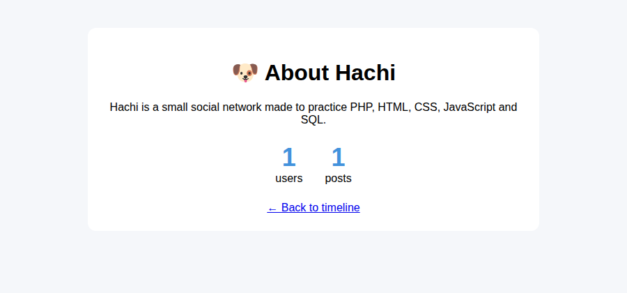

# 7. Tutorial: agregar una página nueva

En este tutorial vas a crear una página **About** que muestra qué es Hachi y cuántos usuarios y posts hay.
Vas a tocar todas las capas del proyecto: punto de entrada, controlador, base de datos, módulo, vista y CSS.

Así va a quedar:



**Antes de empezar:**

- Ten el proyecto funcionando ([1. Instalación](1-instalacion.md)) con `APP_DEBUG=1` en el `.env`, para ver los errores.
- Inicia sesión en la app: la página nueva, igual que el timeline, va a necesitar sesión.
- Lee [2. Arquitectura](2-arquitectura.md), sobre todo la parte de la **convención de nombres**.

> **Cómo funciona este tutorial:** vas a crear las piezas de una en una y a recargar la página después de cada paso.
> Cada vez vas a ver un error distinto, y **cada error te dice qué pieza falta**. Leer los errores con calma
> es una de las habilidades más útiles al programar.

---

## Paso 1: el punto de entrada

Crea el archivo `about.php` en la raíz del proyecto (al lado de `home.php`):

```php
<?php

include 'App/Bootstrap/Bootstrap.php';

\App\Bootstrap\Bootstrap::start();
```

Abre http://localhost:8000/about.php. Vas a ver:

```
Fatal error: Uncaught Error: Class "\App\Controller\AboutController" not found
```

**Es lo esperado.** El Bootstrap convirtió `about.php` en `About` y ahora busca el controlador `AboutController`,
que todavía no existe.

## Paso 2: el controlador

Crea `App/Controller/AboutController.php`:

```php
<?php

namespace App\Controller;

use App\Controller\Base\Controller;
use App\Helpers\Database\Singleton;

/**
 * about.php: qué es Hachi y algunas estadísticas.
 */
class AboutController extends Controller
{
    public function indexAction()
    {
        $this->data = [
            'users' => Singleton::getFacade()->getUserClass()->countUsers(),
            'posts' => Singleton::getFacade()->getPostClass()->countPosts(),
        ];

        $this->postController();
    }
}
```

- El `namespace` (`App\Controller`) tiene que coincidir con la carpeta, y el nombre de la clase con el del archivo.
  Si no, el autoloader no la encuentra.
- `indexAction()` es el método que llama el Bootstrap.
- Guardamos los datos en `$this->data` y `postController()` se los pasa al módulo.

Recarga la página:

```
Fatal error: Uncaught Error: Call to undefined method App\Helpers\Database\Tables\User::countUsers()
```

El controlador ya existe, pero le pide a la tabla `User` un método que no tiene.

## Paso 3: las consultas a la base de datos

Abre `App/Helpers/Database/Tables/User.php` y agrega este método **dentro de la clase**, antes de la última `}`:

```php
    /**
     * Total de usuarios registrados.
     */
    public function countUsers(): int
    {
        $stmt = $this->pdo->prepare("SELECT COUNT(*) FROM users");
        $stmt->execute();
        return (int) $stmt->fetchColumn();
    }
```

Y en `App/Helpers/Database/Tables/Post.php`, también antes de la última `}`:

```php
    /**
     * Total de posts publicados.
     */
    public function countPosts(): int
    {
        $stmt = $this->pdo->prepare("SELECT COUNT(*) FROM posts");
        $stmt->execute();
        return (int) $stmt->fetchColumn();
    }
```

`COUNT(*)` cuenta las filas de la tabla y `fetchColumn()` devuelve ese número.
Aunque esta consulta no recibe datos del usuario, usamos `prepare` + `execute` como en el resto del proyecto.

Recarga:

```
Fatal error: Uncaught Error: Class "App\Module\AboutModule" not found
```

Los datos ya se consultan. Ahora falta quien los muestre.

## Paso 4: el módulo

Crea `App/Module/AboutModule.php`:

```php
<?php

namespace App\Module;

use App\Module\Base\Module;

/**
 * Prepara la página About (App/View/About.view.php).
 */
class AboutModule extends Module
{
    public function indexModel($data)
    {
        // number_format agrega separadores de miles: 12345 -> "12,345"
        $data['users'] = number_format($data['users']);
        $data['posts'] = number_format($data['posts']);

        $this->render($data);
    }
}
```

El módulo prepara los datos para mostrarlos (aquí, les da formato a los números) y llama a `render()`.

Recarga: **la página está en blanco.** No hay error, pero tampoco contenido. `render()` busca la vista
`App/View/About.view.php` y, como no existe, la salta. Si miras el código fuente de la página
(`Ctrl + U`), vas a ver el `<head>` y un `<body>` vacío.

## Paso 5: la vista

Crea `App/View/About.view.php`:

```php
<main class="about">
    <h1>🐶 About Hachi</h1>
    <p>Hachi is a small social network made to practice PHP, HTML, CSS, JavaScript and SQL.</p>

    <div class="stats">
        <div class="stat">
            <strong><?php echo $data['users'] ?></strong>
            <span>users</span>
        </div>
        <div class="stat">
            <strong><?php echo $data['posts'] ?></strong>
            <span>posts</span>
        </div>
    </div>

    <a href="home.php">&larr; Back to timeline</a>
</main>
```

Los datos llegan en `$data`. Aquí no usamos `htmlspecialchars()` porque los números los generó el servidor;
si mostraras algo escrito por un usuario, tendrías que usarlo ([5. Seguridad](5-seguridad.md)).

Recarga: **¡la página funciona!** Pero se ve sin estilos.

## Paso 6: el CSS

Crea `public/css-min/About.min.css`:

```css
body {
  margin: 0;
  background: #f5f7fa;
  font-family: Poppins, sans-serif;
}

.about {
  max-width: 600px;
  margin: 40px auto;
  padding: 24px;
  background: #fff;
  border-radius: 12px;
  text-align: center;
}

.stats {
  display: flex;
  justify-content: center;
  gap: 32px;
  margin: 24px 0;
}

.stat strong {
  display: block;
  font-size: 36px;
  color: #4292dc;
}
```

No hace falta enlazarlo en ningún lado: `Module::addResources()` busca solo un archivo llamado
`About.min.css` y, si existe, lo agrega al `<head>`. Recarga y ya tiene estilo.

> Si creas `public/js-min/About.min.js`, se carga de la misma forma.

## Paso 7: un enlace desde el timeline

Abre `App/View/Home.view.php` y, en la barra superior, agrega el enlace justo antes del de "Log out":

```html
            <a href="about.php" class="logout-link">About</a>
            <a href="logout.php" class="logout-link">Log out</a>
```

Reutiliza la clase `logout-link` para verse igual que "Log out".

## Paso 8 (opcional): que no haga falta iniciar sesión

Cierra la sesión e intenta entrar a `about.php`: te manda al login. Para que la página sea pública,
agrega `'About'` a la lista del Bootstrap (`App/Bootstrap/Bootstrap.php`):

```php
const PUBLIC_CONTROLLERS = ['Index', 'Login', 'Register', 'About'];
```

---

## Si algo falla

| Qué ves | Qué revisar |
|---|---|
| `Class "\App\Controller\AboutController" not found` | Que el archivo se llame exactamente `AboutController.php`, esté en `App/Controller` y tenga `namespace App\Controller;` |
| `Class "App\Module\AboutModule" not found` | Lo mismo para `App/Module/AboutModule.php` y `namespace App\Module;` |
| `Call to undefined method ...countUsers()` | Que el método esté **dentro** de la clase (antes de la última `}`) y bien escrito |
| Página en blanco | Que la vista se llame `About.view.php`, con `A` mayúscula |
| Sin estilos | Que el CSS se llame `About.min.css` y esté en `public/css-min` |
| Te manda al login | La página necesita sesión: inicia sesión o haz el paso 8 |
| Sigues viendo el error anterior después de guardar | Espera 2 segundos y recarga: PHP puede guardar en caché los archivos unos segundos |

> **Ojo con las mayúsculas.** En Windows y en macOS `aboutcontroller.php` y `AboutController.php` suelen ser el mismo archivo,
> pero en los servidores Linux (casi todos los hostings) son distintos. Respeta siempre las mayúsculas.

## Lo que aprendiste

- El nombre del archivo de entrada decide todo lo demás: `about.php` → `AboutController` → `AboutModule` → `About.view.php` → `About.min.css`.
- Cada capa tiene un trabajo: el controlador **consigue** los datos, la tabla **consulta** la base de datos,
  el módulo **prepara** los datos y la vista los **muestra**.
- Los errores te guían: cada uno dice qué pieza falta.

---

## Receta: agregar una acción JSON

Para algo que se hace **sin recargar la página** (como el like), el camino es otro:

1. **La consulta:** agrega el método en la tabla (`App/Helpers/Database/Tables/...`).
2. **El servidor:** agrega un `case` en el `switch` de `PostController::indexAction()` que llame a un método nuevo.
   Ese método valida los datos, usa la tabla y responde con `jsonResponse(['code' => 0, ...])` o `jsonError('...')`.
3. **El navegador:** en `public/js-min/Home.min.js`, llama a `postJson('post.php', {action: 'tu-accion', ...})`
   y actualiza la página con lo que responda.
4. **Pruébalo** con la pestaña **Red** de las herramientas del navegador ([3. Recorrido de una petición](3-recorrido-de-una-peticion.md)).

## Caso real: cómo se hicieron las tendencias

Las tendencias de la semana se agregaron siguiendo este orden. Busca cada parte en el código:

1. **Base de datos:** la tabla `post_hashtags` en `database/schema.sql` y `database/schema.sqlite.sql`.
2. **Un helper nuevo:** `App/Helpers/Hashtag/Hashtag.php`, que encuentra los hashtags de un texto.
3. **Guardar:** `Post::insertPost()` recibe los hashtags y los guarda; `PostController::create()` se los pasa.
4. **Consultar:** `Post::selectWeeklyTrends()` y el filtro `$tag` de `Post::selectTimeline()`.
5. **Controlador:** `HomeController` lee `?tag=` y pide las tendencias.
6. **Módulo:** `HomeModule` convierte los hashtags en enlaces (`content_html`) y arma el texto "3 posts".
7. **Vista:** la columna "Trends this week" y la cabecera del hashtag en `Home.view.php`.
8. **CSS:** las secciones de tendencias y de celulares en `Home.min.css`.

Así se construye casi cualquier funcionalidad: **de la base de datos hacia la pantalla**.

---

[← 6. Frontend](6-frontend.md) · Siguiente: [8. Ejercicios →](8-ejercicios.md)
